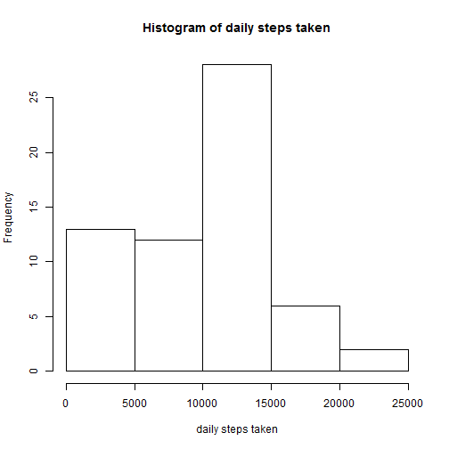
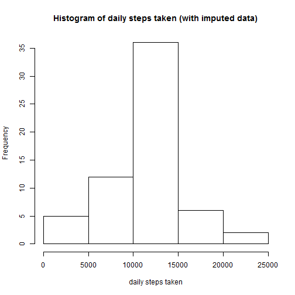
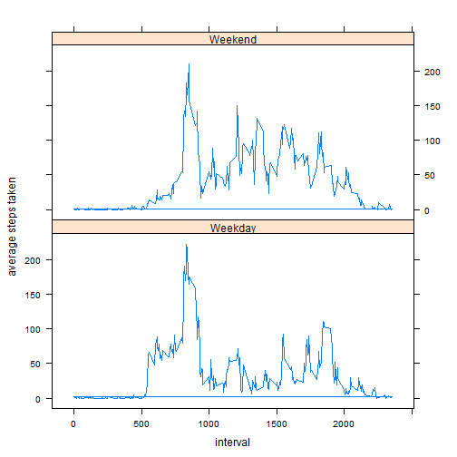

##What is mean total number of steps taken per day?
For this part, we will first start by reading in the "activity" dataset, and
ommitting the observations for which number of steps taken are NA:


```r
data <- read.csv("activity.csv") #assuming the working directory is set correctly
noNAdata <- data[!is.na(data$steps),]
```

After that we can make a list of all dates in the dataset

```r
dates <- names(summary(noNAdata$date))
```

And then create a simple for-loop to summarize the number of steps taken in each
of those dates:


```r
sumsteps <- NULL #creating a NULL object to use in the forloop

for (i in 1:length(dates)){
        count <- sum(noNAdata$steps[noNAdata$date==dates[i]])
        sumsteps <- c(sumsteps, count)
}
names(sumsteps) <- dates #to more easily show how the steps and dates correlate
```

This allows us to make a histogram of the total number of steps taken each day:


```r
hist(sumsteps, main="Histogram of daily steps taken", xlab="daily steps taken")
```

 

And also to calculate the mean and median of the total number of steps taken per day:

```r
print (paste("Mean: ", mean(sumsteps)))
```

```
## [1] "Mean:  9354.22950819672"
```

```r
print (paste("Median: ", median(sumsteps)))
```

```
## [1] "Median:  10395"
```

## What is the average daily activity pattern?
For this part, we calculate the average number of steps taken in each of those
5-minute interval, across all days:


```r
avesteps <- tapply(noNAdata$steps, noNAdata$interval, mean)
```

This dataset allows us to make a time series plot of the 5-minute interval (x-axis)
and the average number of steps taken, averaged across all days (y-axis):


```r
plot(names(avesteps), avesteps, type="l", xlab="interval", ylab="average number of steps")
```

 

And also easily check the identifier for the 5-minute interval which, on average
across all the days in the dataset, contains the maximum number of steps:


```r
names(avesteps[avesteps==max(avesteps)])
```

```
## [1] "835"
```

##Imputing missing values
For this part we are to return to the original dataset (before ommiting NA values)
and impute them.

It is easy to calculate the total number of missing values in the original dataset:

```r
sum(as.numeric(is.na(data$steps)))
```

```
## [1] 2304
```

We can also create a new dataset that is equal to the original dataset but with
the missing data filled in. I decided to do this by using the average mean for
the given 5-minute interval across all days:


```r
filleddata <- data

for (i in 1:sum(as.numeric(is.na(filleddata$steps)))){ #check all missing values
        intervaltocheck <- filleddata$interval[is.na(data$steps)][i] #look for interval
        filleddata$steps[is.na(data$steps)][i] <- avesteps[names(avesteps)==intervaltocheck]
                #replace missing value with average interval value calculated beforehand
}
```

At this point we can re-run the calculations conducted in the first part of the
assignment, to check and see the effect of imputing missing data this way:


```r
dates2 <- names(summary(filleddata$date))

#re-summarizing steps for each day
sumsteps2 <- NULL #creating a NULL object to use in the forloop

for (i in 1:length(dates2)){
        count <- sum(filleddata$steps[filleddata$date==dates2[i]])
        sumsteps2 <- c(sumsteps2, count)
}
names(sumsteps2) <- dates2

#re-creating the histogram
hist(sumsteps2, main="Histogram of daily steps taken (with imputed data)", xlab="daily steps taken")
```

 

```r
print (paste("Mean: ", mean(sumsteps2)))
```

```
## [1] "Mean:  10766.1886792453"
```

```r
print (paste("Median: ", median(sumsteps2)))
```

```
## [1] "Median:  10766.1886792453"
```

These values clearly differ from the estimates from the first part of the assignment.
The impact of imputing missing data on the estimates of the total daily number of
steps, seem to have normalized the distribution of steps among days.

##Are there differences in activity patterns between weekdays and weekends?

We will start by creating a new factor variable in the dataset with two levels –
“weekday” and “weekend”:
        

```r
Sys.setlocale("LC_TIME", "C") #This is done to set the weekdays function to english
```

```
## [1] "C"
```

```r
filleddata$daytype <- NA #creating a new factor

for (i in 1:length(filleddata$steps)){
        ifelse(weekdays(as.POSIXct(filleddata$date[i])) %in% c("Friday", "Saturday", "Sunday"),
               filleddata$daytype[i] <- "Weekend", filleddata$daytype[i] <- "Weekday")
}
```

Secondly we'll subset the data, and re-callculate the average amount of steps
taken within each interval:


```r
filleddata$avestepsbydaytype <- NA

#calculating the average steps by interval for both day types
weekendavesteps <- tapply(filleddata[filleddata$daytype=="Weekend",]$steps,
                          filleddata[filleddata$daytype=="Weekend",]$interval, mean)
weekdayavesteps <- tapply(filleddata[filleddata$daytype=="Weekday",]$steps,
                          filleddata[filleddata$daytype=="Weekday",]$interval, mean)

#merging the calculated steps into the dataset
for (i in 1:length(filleddata$daytype)){
ifelse(filleddata$daytype[i]=="Weekend", 
       filleddata$avestepsbydaytype[i] <- weekendavesteps[names(weekendavesteps)==filleddata$interval[i]],
       filleddata$avestepsbydaytype[i] <- weekdayavesteps[names(weekdayavesteps)==filleddata$interval[i]])
}
```

This new dataset now allows us to make a panel plot containing a time series plot
of the 5-minute interval (x-axis) and the average number of steps taken, averaged
across all weekday days or weekend days (y-axis):


```r
library(lattice)
xyplot(avestepsbydaytype~interval | daytype, data=filleddata, type="l", layout=c(1,2), ylab="average steps taken")
```

 
